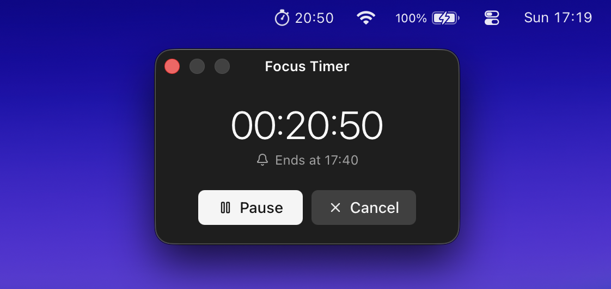

# Focus Timer

macOS menu bar countdown timer.

Requires **macOS 26 (Tahoe)** or newer.



## Features

- Live countdown and controls in the menu bar
- Configurable completion sounds
- Automatic pause when your Mac sleeps
- Persistent timer when app is closed

## Develop

```bash
npm install
npm run tauri dev
```

## Test

```bash
cd src-tauri && cargo test
npm run typecheck
```

## Architecture

- **Rust** owns the timer engine, persistence, tray, sleep detection, and completion sound.
- **React** renders the timer panel and settings window only — no countdown polling.
